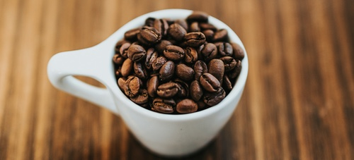

# :fontawesome-solid-mug-hot: Have a cup!

Photo by <a href="https://unsplash.com/@nate_dumlao?utm_content=creditCopyText&utm_medium=referral&utm_source=unsplash">Nathan Dumlao</a> on <a href="https://unsplash.com/photos/round-white-ceramic-mug-with-coffee-beans-lgS6EZq1HGU?utm_content=creditCopyText&utm_medium=referral&utm_source=unsplash">Unsplash</a>

---

The Coffee [Sales](samples.md#sales) data is a good example of accounting and sales data by time, value and location.  It can be joined to the [Travel](samples.md#travel) table to identify patterns where the drinker consumed caffeine in different locations.

It's sourced from ten years of transaction data, captured in a [YNAB](https://www.ynab.com/) Budget, cleaned and simplified.

[Download](downloads.md) the data and take a shot at the [Challenges](challenges.md).
